<properties
    pageTitle="Detect, Triage, Diagnose"
    description="Analyse crashes and detect  and diagnose performance issues in your applications"
    authors="alancameronwills"
    services="application-insights"
    documentationCenter=""
    manager="douge"/>

<tags
    ms.service="application-insights"
    ms.workload="tbd"
    ms.tgt_pltfrm="ibiza"
    ms.devlang="na"
    ms.topic="article" 
    ms.date="11/06/2015"
    ms.author="awills"/>

# Detect, Triage and Diagnose with Application Insights

*Application Insights is in preview.*

Application Insights helps you find out how your app is performing and being used when it's live. And if there's a problem, it lets you know about it, helps you assess the impact, and helps you determine the cause.

Here's an account from a team that develops web applications:

* *"A couple of days ago, we deployed a 'minor' hotfix. We didn't run a broad test pass, but unfortunately some unexpected change got merged into the payload, causing incompatibility between the front and back ends. Immediately, server exceptions surged, our alert fired, and we were made aware of the situation. A few clicks away on the Application Insights portal, we got enough information from exception callstacks to narrow down the problem. We rolled back immediately and limited the damage. Application Insights has made this part of the devops cycle very easy and actionable."*

Let's see how a typical web development team uses Application Insights to monitor performance. We'll follow the team in Fabrikam Bank that develops the online banking system (OBS).

The team works on a cycle like this:

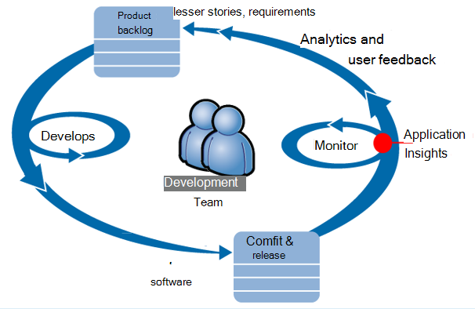

Requirements feed into their development backlog (task list). They work in short sprints, which often deliver working software - usually in the form of improvements and extensions to the existing application. The live app is frequently updated with new features. While it's live, the team monitors it for performance and usage with the help of Application Insights. This analysis feeds back into their development backlog.

The team uses Application Insights to monitor the live web application closely for:
* Performance. They want to understand how response times vary with request count; how much CPU, network, disk, and other resources are being used; and where the bottlenecks are.
* Failures. If there are exceptions or failed requests, or if a performance counter goes outside its comfortable range, the team needs to know rapidly so that they can take action.
* Usage. Whenever a new feature is released, the team want to know to what extent it is used, and whether users have any difficulties with it.

Let's focus on the feedback part of the cycle:

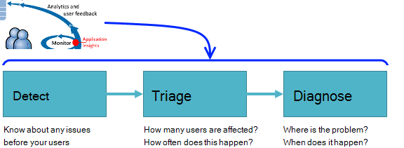

## Detect poor availability

Marcela Markova is a senior developer on the OBS team, and takes the lead on monitoring online performance. She sets up several [web tests][availability]:

* A single-URL test for the main landing page for the app, http://fabrikambank.com/onlinebanking/. She sets criteria of HTTP code 200 and text 'Welcome!'. If this test fails, there's something seriously wrong with the network or the servers, or maybe a deployment issue. (Or someone has changed the Welcome! message on the page without letting her know.)

* A deeper multi-step test, which logs in and gets a current account listing, checking a few key details on each page. This test verifies that the link to the accounts database is working. She uses a fictitious customer id: a few of them are maintained for test purposes.

With these tests set up, Marcela is confident that the team will quickly know about any outage.  

Failures show up as red dots on the web test chart:

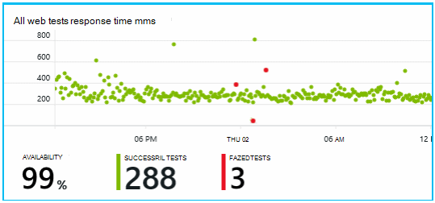

But more importantly, an alert about any failure will be emailed to the development team. In that way, they know about it before nearly all of the customers.

## Monitor performance metrics

On the overview page in Application Insights, there's a chart that shows a variety of [key metrics][perf].

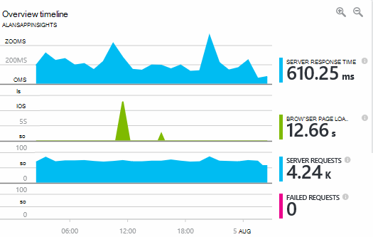

Browser page load time is derived from telemetry sent directly from web pages. Server response time, server request count and failed request count are all measured in the web server and sent to Application Insights from there.

Marcela is slightly concerned with at the server response graph, which shows the average time between when the server receives an HTTP request from a user's browser, and when it returns the response. It isn't unusual to see a variation in this chart, as load on the system varies. But in this case, there seems to be a correlation between small rises in the count of requests, and big rises in the response time. That could indicate that the system is operating just at its limits. 

She opens the Servers charts:

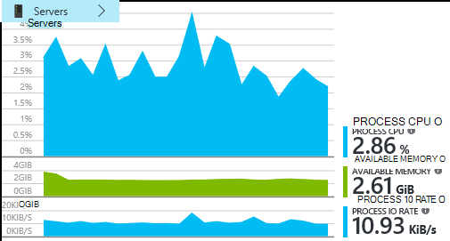

There seems to be no sign of resource limitation there, so maybe the bumps in the server response charts are just a coincidence.

## Alerts

Nevertheless, she'd like to keep an eye on the response times. If they go too high, she wants to know about it immediately.

So she sets an [alerts][metrics], for response times greater than a typical threshold. This gives her confidence that she'll know about it if response times are slow.

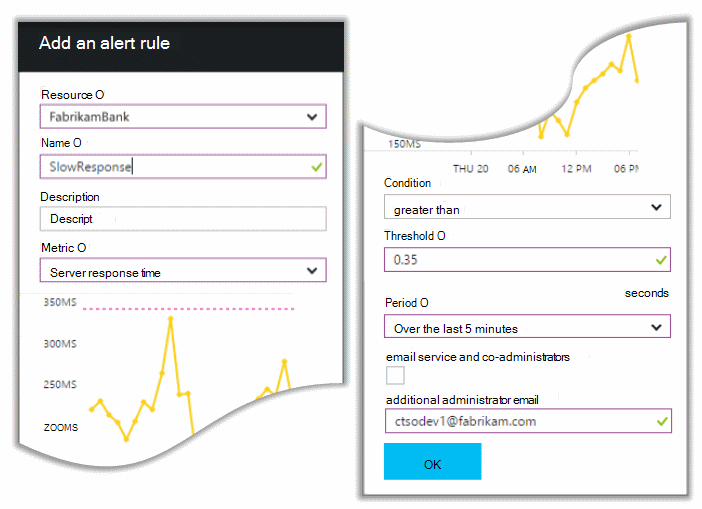

Alerts can be set on a wide variety of other metrics. For example, you can receive emails if the exception count becomes high, or the available memory goes low, or if there is a peak in client requests.

## Proactive diagnostic alerts

Next day, an alert email does arrive from Application Insights. But when she opens it, she finds isn't the response time alert that she set. Instead, it tells her there's been a sudden rise in failed requests - that is, requests that have returned failure codes of 500 or more.

Failed requests are where users have seen an error - typically following an exception thrown in the code. Maybe they see a message saying "Sorry we couldn't update your details right now" or, at absolute embarrassing worst, a stack dump on the user's screen, courtesy of the web server.

This alert is a surprise, because the last time she looked at it, the failed request count was encouragingly low. A small number of failures is to be expected in a busy server. 

It was also a bit of a surprise for her because she didn't have to configure this alert. In fact, Proactive Diagnostics comes automatically with Application Insights. It automatically adjusts to your app's usual failure pattern, and "gets used to" failures on a particular page, or under high load, or linked to other metrics. It raises the alarm only if there's a rise above what it comes to expect.

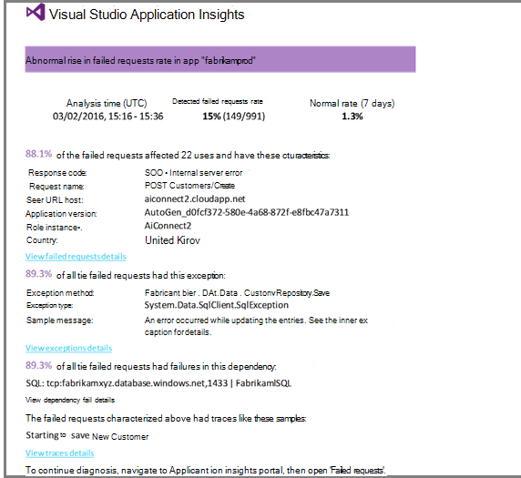

This is a very useful email. It doesn't just raise an alarm; it does a lot of the triage and diagnostic work, too.

It shows how many customers are affected, and which web pages or operations. Marcela can decide whether she needs to get the whole team working on this as a fire drill, or whether it can be ignored until next week.

The email also shows that a particular exception occurred, and - even more interesting - that the failure is associated with failed calls to a particular database. This explains why the fault suddenly appeared even though Marcela's team has not deployed any updates recently. 

She pings the leader of the database team. Yes, they released a hot fix in the past half hour; and Oops, maybe there might have been a minor schema change....

So the problem is on the way to being fixed, even before investigating logs, and within 15 minutes of it arising. However, Marcela clicks on the link to open Application Insights. It opens straight onto a failed request, and she can see the failed database call in the associated list of dependency calls. 

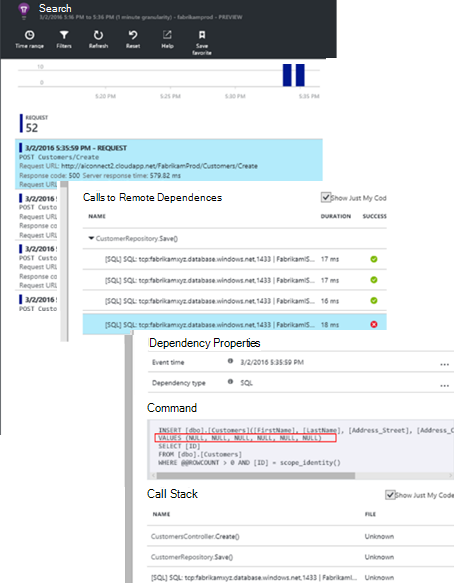

## Detecting exceptions

With a little bit of setup, [exceptions](app-insights-asp-net-exceptions.md) are reported to Application Insights automatically. They can also be captured explicitly by inserting calls to [TrackException()](app-insights-api-custom-events-metrics.md#track-exception) into the code:  

    var telemetry = new TelemetryClient();
    ...
    try
    { ...
    }
    catch (Exception ex)
    {
       // Set up some properties:
       var properties = new Dictionary <string, string>
         {{"Game", currentGame.Name}};

       var measurements = new Dictionary <string, double>
         {{"Users", currentGame.Users.Count}};

       // Send the exception telemetry:
       telemetry.TrackException(ex, properties, measurements);
    }

The Fabrikam Bank team has evolved the practice of always sending telemetry on an exception, unless there's an obvious recovery.  

In fact, their strategy is even broader than that: They send telemetry in every case where the customer is frustrated in what they wanted to do, whether it corresponds to an exception in the code or not. For example, if the external inter-bank transfer system returns a "can't complete this transaction" message for some operational reason (no fault of the customer) then they track that event.

    var successCode = AttemptTransfer(transferAmount, ...);
    if (successCode < 0)
    {
       var properties = new Dictionary <string, string>
            {{ "Code", returnCode, ... }};
       var measurements = new Dictionary <string, double>
         {{"Value", transferAmount}};
       telemetry.TrackEvent("transfer failed", properties, measurements);
    }

TrackException is used to report exceptions because it sends a copy of the stack; TrackEvent is used to report other events. You can attach any properties that might be useful in diagnosis.

Exceptions and events show up in the [Diagnostic Search][diagnostic] blade. You can drill into them to see the additional properties and stack trace.

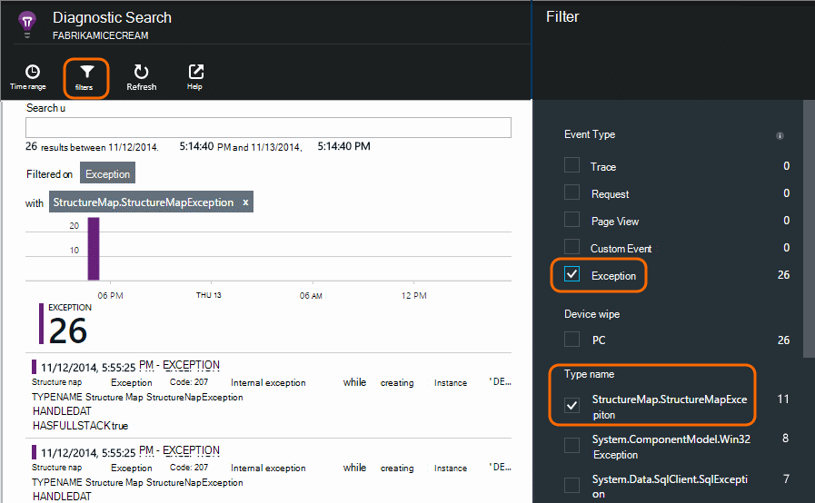

## Monitoring user activity

When response time is consistently good and there are few exceptions, the dev team can think about how to improve the users' experience, and how to encourage more users to achieve the desired goals.

For example, a typical user journey through the web site has a clear 'funnel': Many customers look at the rates of different types of loan; some of them fill in the quotation form; and of those who get a quotation, a few go ahead and take out the loan.

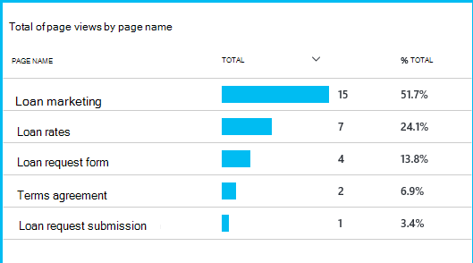

By considering where the greatest numbers of customers drop out, the business can work out how to get more users through to the bottom of the funnel. In some cases there might be a user experience (UX) failure - for example, the 'next' button is hard to find, or the instructions aren't obvious. More likely, there are more significant business reasons for drop-outs: maybe the loan rates are too high.

Whatever the reasons, the data helps the team work out what users are doing. More tracking calls can be inserted to work out more detail. TrackEvent() can be used to count any user actions, from the fine detail of individual button clicks to significant achievements such as paying off a loan.

The team is getting used to having information about user activity. Nowadays, whenever they design a new feature, they work out how they will get feedback about its usage. They design tracking calls into the feature from the start. They use the feedback to improve the feature in each development cycle.

## Proactive monitoring  

Marcela doesn't just sit around waiting for alerts. Soon after every redeployment, she takes a look at [response times][perf] - both the overall figure and the table of slowest requests, as well as exception counts.  

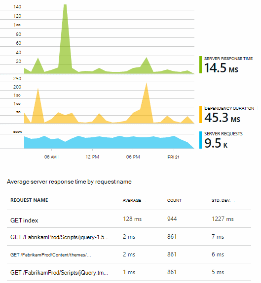

She can assess the performance effect of every deployment, typically comparing each week with the last. If there's a sudden worsening, she raises that with the relevant developers.

## Triage

Triage - assessing the severity and extent of a problem - is the first step after detection. Should we call out the team at midnight? Or can it be left until the next convenient gap in the backlog? There are some key questions in triage.

How much is it happening? The charts on the Overview blade give some perspective to a problem. For example, the Fabrikam application generated four web test alerts one night. Looking at the chart in the morning, the team could see that there were indeed some red dots, though still most of the tests were green. Drilling into the availability chart, it was clear that all of these intermittent problems were from one test location. This was obviously a network issue affecting only one route, and would most likely clear itself.  

By contrast, a dramatic and stable rise in the graph of exception counts or response times is obviously something to panic about.

A useful triage tactic is Try It Yourself. If you run into the same problem, you know it's real.

What fraction of users are affected? To obtain a rough answer, divide the failure rate by the session count.

In the case of slow response, compare the table of slowest-responding requests with the usage frequency of each page.

How important is the blocked scenario? If this is a functional problem blocking a particular user story, does it matter much? If customers can't pay their bills, this is serious; if they can't change their screen color preferences, maybe it can wait. The detail of the event or exception, or the identity of the slow page, tells you where customers are having trouble.

## Diagnosis

Diagnosis isn't quite the same as debugging. Before you start tracing through the code, you should have a rough idea of why, where and when the issue is occurring.

**When does it happen?** The historical view provided by the event and metric charts makes it easy to correlate effects with possible causes. If there are intermittent peaks in response time or exception rates, look at the request count: if it peaks at the same time, then it looks like a resource problem. Do you need to assign more CPU or memory? Or is it a dependency that can't manage the load?

**Is it us?**  If you have a sudden drop in performance of a particular type of request - for example when the customer wants an account statement - then there's a possibility it might be an external subsystem rather than your web application. In Metrics Explorer, select the Dependency Failure rate and Dependency Duration rates and compare their histories over the past few hours or days with the problem you detected. If there are correlating changes, then an external subsystem might be to blame.  

Some slow dependency issues are geolocation problems. Fabrikam Bank uses Azure virtual machines, and discovered that they had inadvertently located their web server and account server in different countries. A dramatic improvement was brought about by migrating one of them.

**What did we do?** If the issue doesn't appear to be in a dependency, and if it wasn't always there, it's probably caused by a recent change. The historical perspective provided by the metric and event charts makes it easy to correlate any sudden changes with deployments. That narrows down the search for the problem.

**What's going on?** Some problems occur only rarely and can be difficult to track down by testing offline. All we can do is to try to capture the bug when it occurs live. You can inspect the stack dumps in exception reports. In addition, you can write tracing calls, either with your favourite logging framework or with TrackTrace() or TrackEvent().  

Fabrikam had an intermittent problem with inter-account transfers, but only with certain account types. To understand better what was happening, they inserted TrackTrace() calls at key points in the code, attaching the account type as a property to each call. That made it easy to filter out just those traces in Diagnostic Search. They also attached parameter values as properties and measures to the trace calls.

## Dealing with it

Once you've diagnosed the issue, you can make a plan to fix it. Maybe you need to roll back a recent change, or maybe you can just go ahead and fix it. Once the fix is done, Application Insights will tell you whether you succeeded.  

Fabrikam Bank's development team take a more structured approach to performance measurement than they used to before they used Application Insights.

* They set performance targets in terms of specific measures in the Application Insights overview page.

* They design performance measures into the application from the start, such as the metrics that measure user progress through 'funnels.'  

## Usage

Application Insights can also be used to learn what users do with an app. Once it's running smoothly, the team would like to know which features are the most popular, what users like or have difficulty with, and how often they come back. That will help them prioritize their upcoming work. And they can plan to measure the success of each feature as part of the development cycle. [Read more][usage].

## Your applications

So that's how one team use Application Insights not just to fix individual issues, but to improve their development lifecycle. I hope it has given you some ideas about how Application Insights can help you improve the performance of your own applications.

## Video

[AZURE.VIDEO performance-monitoring-application-insights]

<!--Link references-->

[api]: app-insights-api-custom-events-metrics.md
[availability]: app-insights-monitor-web-app-availability.md
[diagnostic]: app-insights-diagnostic-search.md
[metrics]: app-insights-metrics-explorer.md
[perf]: app-insights-web-monitor-performance.md
[usage]: app-insights-web-track-usage.md
 
