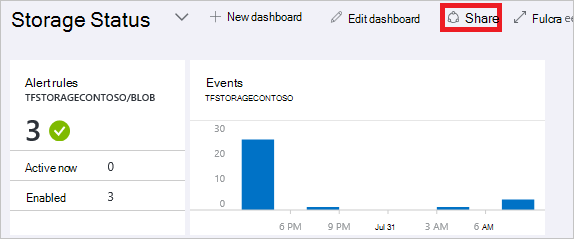
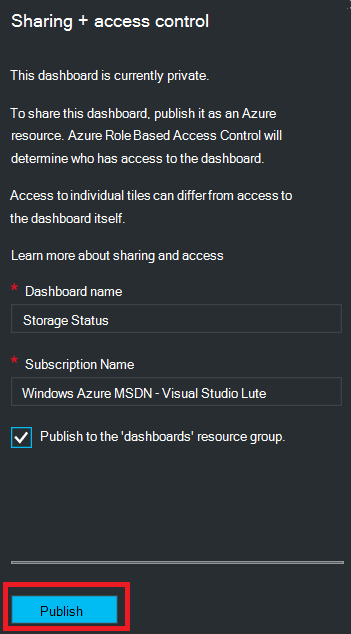
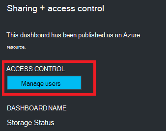
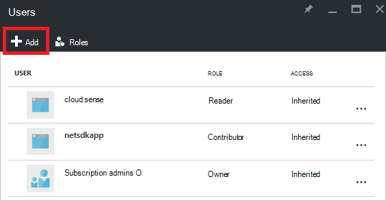
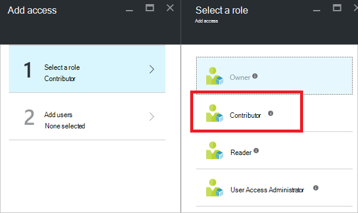
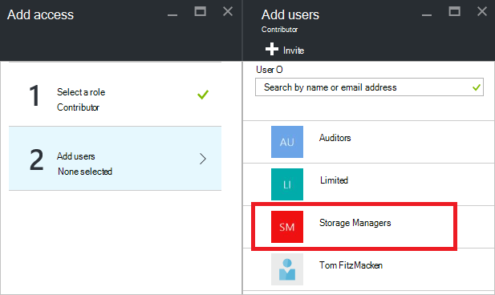
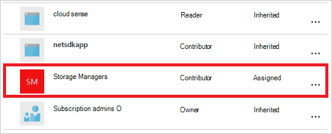

<properties
   pageTitle="Azure portal dashboard access | Microsoft Azure"
   description="This article explains how to share access to a dashboard in the Azure portal."
   services="azure-portal"
   documentationCenter=""
   authors="tfitzmac"
   manager="timlt"
   editor="tysonn"/>

<tags
   ms.service="multiple"
   ms.devlang="NA"
   ms.topic="article"
   ms.tgt_pltfrm="NA"
   ms.workload="na"
   ms.date="08/01/2016"
   ms.author="tomfitz"/>

# Sharing Azure dashboards

After configuring a dashboard, you can publish it and share it with other users in your organization. You permit others to access your dashboard by using Azure [Role Based Access Control](../active-directory/role-based-access-control-configure.md). You assign a user or group of users to a role, and that role defines whether those users can view or modify the published dashboard. 

All published dashboards are implemented as Azure resources, which means they exist as manageable items within your subscription and are contained in a resource group.  From an access control perspective, dashboards are no different than other resources, such as a virtual machine or a storage account.

> [AZURE.TIP] Individual tiles on the dashboard enforce their own access control requirements based on the resources they display.  Therefore, you can design a dashboard that is shared broadly while still protecting the data on individual tiles.

## Understanding access control for dashboards

With role-based access control, you can assign users to roles at three different levels of scope:

- subscription
- resource group
- resource

The permissions you assign are inherited from subscription down to the resource. The published dashboard is a resource. Therefore, you may already have users assigned to roles for the subscription which also work for the published dashboard. 

Here is an example.  Let's say you have an Azure subscription and various members of your team have been assigned the roles of **owner**, **contributor**, or **reader** for the subscription. Users who are owners or contributors are able to list, view, create, modify, or delete dashboards within the subscription.  Users who are readers are able to list and view dashboards, but cannot modify or delete them.  Users with reader access are able to make local edits to a published dashboard (such as, when troubleshooting an issue), but are not able to publish those changes back to the server.  They will have the option to make a private copy of the dashboard for themselves

However, you could also assign permissions to the resource group that contains several dashboards or to an individual dashboard. For example, you may decide that a group of users should have limited permissions across the subscription but greater access to a particular dashboard. You assign those users to a role for that dashboard. 

## Publish dashboard

Let's suppose you have finished configuring a dashboard that you want to share with a group of users in your subscription. The steps below depict a customized group called Storage Managers, but you can name your group whatever you would like. For information about creating an Active Directory group and adding users to that group, see [Managing groups in Azure Active Directory](../active-directory/active-directory-accessmanagement-manage-groups.md).

1. In the dashboard, select **Share**.

     

2. Before assigning access, you must publish the dashboard. By default, the dashboard will be published to a resource group named **dashboards**. Select **Publish**.

     

Your dashboard is now published. If the permissions inherited from the subscription are suitable, you do not need to do anything more. Other users in your organization will be able to access and modify the dashboard based on their subscription level role. However, for this tutorial, let's assign a group of users to a role for that dashboard.

## Assign access to a dashboard

1. After publishing the dashboard, select **Manage users**.

     

2. You will see a list of existing users that are already assigned a role for this dashboard. Your list of existing users will be different than the image below. Most likely, the assignments are inherited from the subscription. To add a new user or group, select **Add**.

     

3. Select the role that represents the permissions you would like to grant. For this example, select **Contributor**.

     

4. Select the user or group that you wish to assign to the role. If you do not see the user or group you are looking for in the list, use the search box. Your list of available groups will depend on the groups you have created in your Active Directory.

      

5. When you have finished adding users or groups, select **OK**. 

6. The new assignment is added to the list of users. Notice that its **Access** is listed as **Assigned** rather than **Inherited**.

     

## Next steps

- For a list of roles, see [RBAC: Built-in roles](../active-directory/role-based-access-built-in-roles.md).
- To learn about managing resources, see [Manage Azure resources through portal](resource-group-portal.md).