<properties
    pageTitle="First look: Protect Azure VMs with a recovery services vault | Microsoft Azure"
    description="Protect Azure VMs with a recovery services vault. Use backups of Resource Manager-deployed VMs, Classic-deployed VMs and Premium Storage VMs to protect your data. Create and register a recovery services vault. Register VMs, create policy, and protect VMs in Azure."
    services="backup"
    documentationCenter=""
    authors="markgalioto"
    manager="cfreeman"
    editor=""
    keyword="backups; vm backup"/>

<tags
    ms.service="backup"
    ms.workload="storage-backup-recovery"
    ms.tgt_pltfrm="na"
    ms.devlang="na"
    ms.topic="hero-article"
    ms.date="10/13/2016"
    ms.author="markgal; jimpark"/>

# First look: Protect Azure VMs with a recovery services vault

> [AZURE.SELECTOR]
- [Protect VMs with a recovery services vault](backup-azure-vms-first-look-arm.md)
- [Protect VMs with a backup vault](backup-azure-vms-first-look.md)

This tutorial takes you through the steps for creating a recovery services vault and backing up an Azure virtual machine (VM). Recovery services vaults protect:

- Azure Resource Manager-deployed VMs
- Classic VMs
- Standard storage VMs
- Premium storage VMs
- VMs encrypted using Azure Disk Encryption, with BEK and KEK

For more information on protecting Premium storage VMs, see [Back up and Restore Premium Storage VMs](backup-introduction-to-azure-backup.md#back-up-and-restore-premium-storage-vms)

>[AZURE.NOTE] This tutorial assumes you already have a VM in your Azure subscription and that you have taken measures to allow the backup service to access the VM.

[AZURE.INCLUDE [learn-about-Azure-Backup-deployment-models](../../includes/backup-deployment-models.md)]

At a high level, here are the steps that you'll complete.  

1. Create a recovery services vault for a VM.
2. Use the Azure portal to select a Scenario, set Policy, and identify items to protect.
3. Run the initial backup.

## Create a recovery services vault for a VM

A recovery services vault is an entity that stores all the backups and recovery points that have been created over time. The recovery services vault also contains the backup policy applied to the protected VMs.

>[AZURE.NOTE] Backing up VMs is a local process. You cannot back up VMs from one location to a recovery services vault in another location. So, for every Azure location that has VMs to be backed up, at least one recovery services vault must exist in that location.

To create a recovery services vault:

1. Sign in to the [Azure portal](https://portal.azure.com/).

2. On the Hub menu, click **Browse** and in the list of resources, type **Recovery Services**. As you begin typing, the list filters based on your input. Click **Recovery Services vault**.

      

    The list of recovery services vaults are displayed.

3. On the **Recovery Services vaults** menu, click **Add**.

    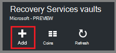

    The Recovery Services vault blade opens, prompting you to provide a **Name**, **Subscription**, **Resource group**, and **Location**.

    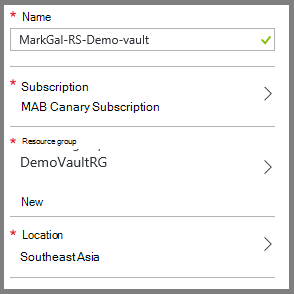

4. For **Name**, enter a friendly name to identify the vault. The name needs to be unique for the Azure subscription. Type a name that contains between 2 and 50 characters. It must start with a letter, and can contain only letters, numbers, and hyphens.

5. Click **Subscription** to see the available list of subscriptions. If you are not sure which subscription to use, use the default (or suggested) subscription. There are multiple choices only if your organizational account is associated with multiple Azure subscriptions.

6. Click **Resource group** to see the available list of Resource groups, or click **New** to create a Resource group. For complete information on Resource groups, see [Azure Resource Manager overview](../azure-resource-manager/resource-group-overview.md)

7. Click **Location** to select the geographic region for the vault. The vault **must** be in the same region as the virtual machines that you want to protect.

    >[AZURE.IMPORTANT] If you are unsure of the location in which your VM exists, close out of the vault creation dialog, and go to the list of Virtual Machines in the portal. If you have virtual machines in multiple regions, create a recovery services vault in each region. Create the vault in the first location before going to the next location. There is no need to specify storage accounts to store the backup data--the recovery services vault and the Azure Backup service handle this automatically.

8. Click **Create**. It can take a while for the recovery services vault to be created. Monitor the status notifications in the upper right-hand area in the portal. Once your vault is created, it appears in the list of recovery services vaults.

    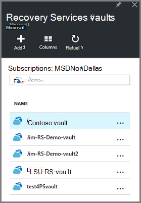

Now that you've created your vault, learn how to set the storage replication.

### Set Storage Replication

The storage replication option allows you to choose between geo-redundant storage and locally redundant storage. By default, your vault has geo-redundant storage. Leave the option set to geo-redundant storage if this is your primary backup. Choose locally redundant storage if you want a cheaper option that isn't as durable. Read more about [geo-redundant](../storage/storage-redundancy.md#geo-redundant-storage) and [locally redundant](../storage/storage-redundancy.md#locally-redundant-storage) storage options in the [Azure Storage replication overview](../storage/storage-redundancy.md).

To edit the storage replication setting:

1. Select your vault to open the vault dashboard and the Settings blade. If the **Settings** blade doesn't open, click **All settings** in the vault dashboard.

2. On the **Settings** blade, click **Backup Infrastructure** > **Backup Configuration** to open the **Backup Configuration** blade. On the **Backup Configuration** blade, choose the storage replication option for your vault.

    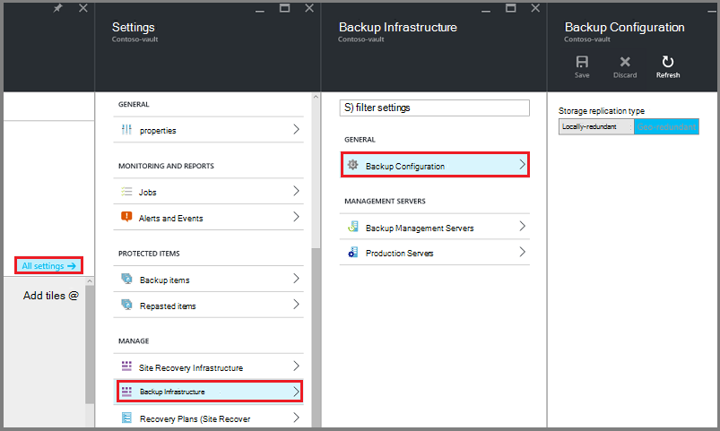

    After choosing the storage option for your vault, you are ready to associate the VM with the vault. To begin the association, you should discover and register the Azure virtual machines.

## Select a backup goal, set policy and define items to protect

Before registering a VM with a vault, run the discovery process to ensure that any new virtual machines that have been added to the subscription are identified. The process queries Azure for the list of virtual machines in the subscription, along with additional information like the cloud service name and the region. In the Azure portal, scenario refers to what you are going to put into the recovery services vault. Policy is the schedule for how often and when recovery points are taken. Policy also includes the retention range for the recovery points.

1. If you already have a recovery services vault open, proceed to step 2. If you do not have a recovery services vault open, but are in the Azure portal, on the Hub menu, click **Browse**.

  - In the list of resources, type **Recovery Services**.
  - As you begin typing, the list filters based on your input. When you see **Recovery Services vaults**, click it.

      

    The list of recovery services vaults appears.
  - From the list of recovery services vaults, select a vault.

    The selected vault dashboard opens.

    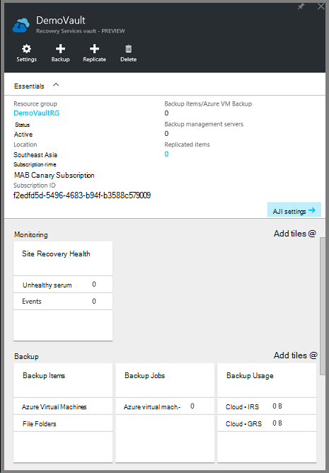

2. From the vault dashboard menu, click **Backup** to open the Backup blade.

    

    When the blade opens, the Backup service searches for any new VMs in the subscription.

    

3. On the Backup blade, click **Backup goal** to open the Backup Goal blade.

    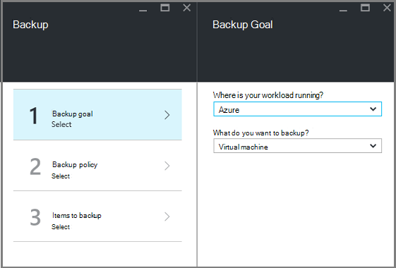

4. On the Backup Goal blade, set **Where is your workload running** to Azure and  **What do you want to backup** to Virtual machine, then click **OK**.

    The Backup Goal blade closes and the Backup policy blade opens.

    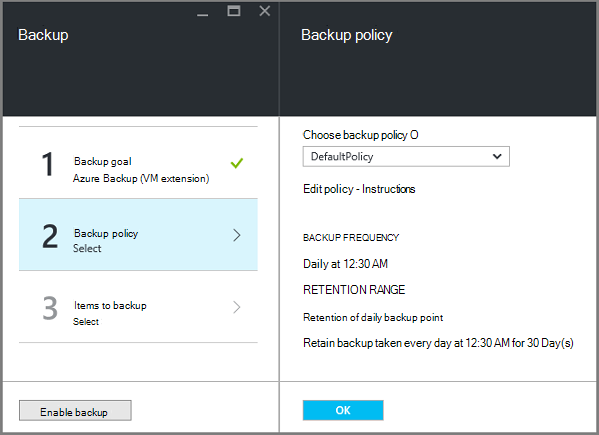

5. On the Backup policy blade, select the backup policy you want to apply to the vault and click **OK**.

    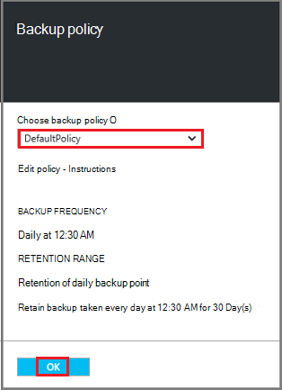

    The details of the default policy are listed in the details. If you want to create a policy, select **Create New** from the drop-down menu. The drop-down menu also provides an option to switch the time when the snapshot is taken, to 7PM. For instructions on defining a backup policy, see [Defining a backup policy](backup-azure-vms-first-look-arm.md#defining-a-backup-policy). Once you click **OK**, the backup policy is associated with the vault.

    Next choose the VMs to associate with the vault.

6. Choose the virtual machines to associate with the specified policy and click **Select**.

    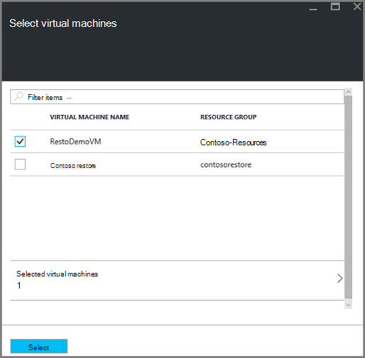

    If you do not see the desired VM, check that it exists in the same Azure location as the Recovery Services vault.

7. Now that you have defined all settings for the vault, in the Backup blade click **Enable Backup** at the bottom of the page. This deploys the policy to the vault and the VMs.

    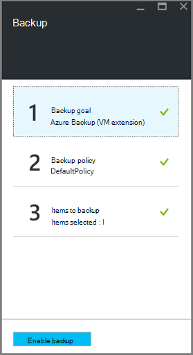

## Initial backup

Once a backup policy has been deployed on the virtual machine, that does not mean the data has been backed up. By default, the first scheduled backup (as defined in the backup policy) is the initial backup. Until the initial backup occurs, the Last Backup Status on the **Backup Jobs** blade shows as **Warning(initial backup pending)**.

Unless your initial backup is due to begin soon, it is recommended that you run **Back up Now**.

To run **Back up Now**:

1. On the vault dashboard, on the **Backup** tile, click **Azure Virtual Machines**  
    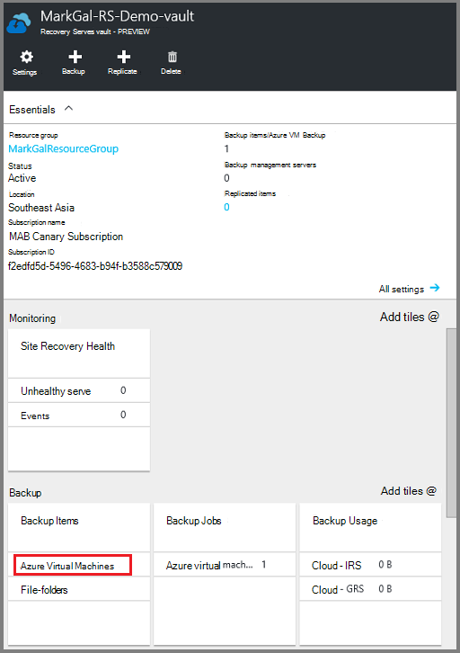

    The **Backup Items** blade opens.

2. On the **Backup Items** blade, right-click the vault you want to back up, and click **Backup now**.

    

    The Backup job is triggered.  

    

3. To view that your initial backup has completed, on the vault dashboard, on the **Backup Jobs** tile, click **Azure virtual machines**.

    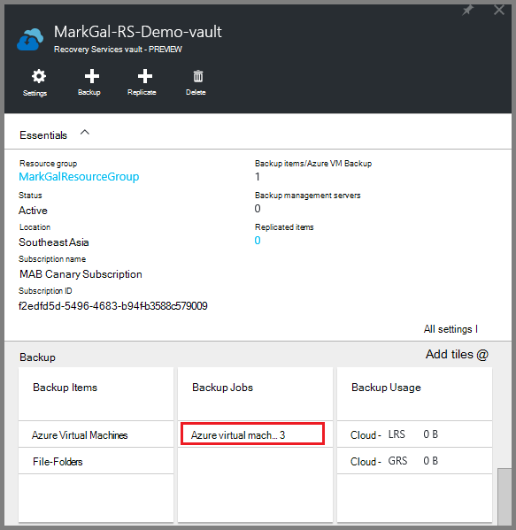

    The Backup Jobs blade opens.

4. In the Backup jobs blade, you can see the status of all jobs.

    

    >[AZURE.NOTE] As a part of the backup operation, the Azure Backup service issues a command to the backup extension in each VM to flush all writes and take a consistent snapshot.

    When the backup job is finished, the status is *Completed*.

[AZURE.INCLUDE [backup-create-backup-policy-for-vm](../../includes/backup-create-backup-policy-for-vm.md)]

## Install the VM Agent on the virtual machine

This information is provided in case it is needed. The Azure VM Agent must be installed on the Azure virtual machine for the Backup extension to work. However, if your VM was created from the Azure gallery, then the VM Agent is already present on the virtual machine. VMs that are migrated from on-premises datacenters would not have the VM Agent installed. In such a case, the VM Agent needs to be installed. If you have problems backing up the Azure VM, check that the Azure VM Agent is correctly installed on the virtual machine (see the table below). If you create a custom VM, [ensure the **Install the VM Agent** check box is selected](../virtual-machines/virtual-machines-windows-classic-agents-and-extensions.md) before the virtual machine is provisioned.

Learn about the [VM Agent](https://go.microsoft.com/fwLink/?LinkID=390493&clcid=0x409) and [how to install it](../virtual-machines/virtual-machines-windows-classic-manage-extensions.md).

The following table provides additional information about the VM Agent for Windows and Linux VMs.

| **Operation** | **Windows** | **Linux** |
| --- | --- | --- |
| Installing the VM Agent | <li>Download and install the [agent MSI](http://go.microsoft.com/fwlink/?LinkID=394789&clcid=0x409). You need Administrator privileges to complete the installation. <li>[Update the VM property](http://blogs.msdn.com/b/mast/archive/2014/04/08/install-the-vm-agent-on-an-existing-azure-vm.aspx) to indicate that the agent is installed. | <li> Install the latest [Linux agent](https://github.com/Azure/WALinuxAgent) from GitHub. You need Administrator privileges to complete the installation. <li> [Update the VM property](http://blogs.msdn.com/b/mast/archive/2014/04/08/install-the-vm-agent-on-an-existing-azure-vm.aspx) to indicate that the agent is installed. |
| Updating the VM Agent | Updating the VM Agent is as simple as reinstalling the [VM Agent binaries](http://go.microsoft.com/fwlink/?LinkID=394789&clcid=0x409).  Ensure that no backup operation is running while the VM agent is being updated. | Follow the instructions on [updating the Linux VM Agent ](../virtual-machines-linux-update-agent.md).  Ensure that no backup operation is running while the VM Agent is being updated. |
| Validating the VM Agent installation | <li>Navigate to the *C:\WindowsAzure\Packages* folder in the Azure VM. <li>You should find the WaAppAgent.exe file present.<li> Right-click the file, go to **Properties**, and then select the **Details** tab. The Product Version field should be 2.6.1198.718 or higher. | N/A |

### Backup extension

Once the VM Agent is installed on the virtual machine, the Azure Backup service installs the backup extension to the VM Agent. The Azure Backup service seamlessly upgrades and patches the backup extension without additional user intervention.

The backup extension is installed by the Backup service whether the VM is running. A running VM provides the greatest chance of getting an application-consistent recovery point. However, the Azure Backup service continues to back up the VM even if it is turned off, and the extension could not be installed. This is known as Offline VM. In this case, the recovery point will be *crash consistent*.

## Troubleshooting information
If you have issues accomplishing some of the tasks in this article, consult the [Troubleshooting guidance](backup-azure-vms-troubleshoot.md).

## Pricing
Azure VM backup will be charged based on Protected Instances model. Learn more on [Backup Pricing](https://azure.microsoft.com/pricing/details/backup/)

## Questions?
If you have questions, or if there is any feature that you would like to see included, [send us feedback](http://aka.ms/azurebackup_feedback).
