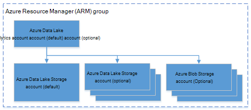

<properties 
   pageTitle="Manage Azure Data Lake Analytics using Azure .NET SDK | Azure" 
   description="Learn how to manage Data Lake Analytics jobs, data sources, users. " 
   services="data-lake-analytics" 
   documentationCenter="" 
   authors="mumian" 
   manager="jhubbard" 
   editor="cgronlun"/>
 
<tags
   ms.service="data-lake-analytics"
   ms.devlang="na"
   ms.topic="article"
   ms.tgt_pltfrm="na"
   ms.workload="big-data" 
   ms.date="09/23/2016"
   ms.author="jgao"/>

# Manage Azure Data Lake Analytics using Azure .NET SDK

[AZURE.INCLUDE [manage-selector](../../includes/data-lake-analytics-selector-manage.md)]

Learn how to manage Azure Data Lake Analytics accounts, data sources, users, and jobs using the Azure .NET SDK. To see management topics using other tools, click the tab select above.

**Prerequisites**

Before you begin this tutorial, you must have the following:

- **An Azure subscription**. See [Get Azure free trial](https://azure.microsoft.com/pricing/free-trial/).

<!-- ################################ -->
<!-- ################################ -->

## Connect to Azure Data Lake Analytics

You will need the following Nuget packages:

    Install-Package Microsoft.Rest.ClientRuntime.Azure.Authentication -Pre
    Install-Package Microsoft.Azure.Common 
    Install-Package Microsoft.Azure.Management.ResourceManager -Pre
    Install-Package Microsoft.Azure.Management.DataLake.Analytics -Pre

The following code sample shows you how to connect to Azure and list the existing Data Lake Analytics accounts under your Azure subscription.

    using System;
    using System.Collections.Generic;
    using System.Threading;

    using Microsoft.Rest;
    using Microsoft.Rest.Azure.Authentication;

    using Microsoft.Azure.Management.ResourceManager;
    using Microsoft.Azure.Management.DataLake.Store;
    using Microsoft.Azure.Management.DataLake.Analytics;
    using Microsoft.Azure.Management.DataLake.Analytics.Models;

    namespace ConsoleAcplication1
    {
        class Program
        {

            private const string SUBSCRIPTIONID = "<Enter Your Azure Subscription ID>";
            private const string CLIENTID = "1950a258-227b-4e31-a9cf-717495945fc2";
            private const string DOMAINNAME = "common"; // Replace this string with the user's Azure Active Directory tenant ID or domain name, if needed.

            private static DataLakeAnalyticsAccountManagementClient _adlaClient;

            private static void Main(string[] args)
            {

                var creds = AuthenticateAzure(DOMAINNAME, CLIENTID);

                _adlaClient = new DataLakeAnalyticsAccountManagementClient(creds);
                _adlaClient.SubscriptionId = SUBSCRIPTIONID;

                var adlaAccounts = ListADLAAccounts();

                Console.WriteLine("You have %i Data Lake Analytics account(s).", adlaAccounts.Count);
                for (int i = 0; i < adlaAccounts.Count; i ++)
                {
                    Console.WriteLine(adlaAccounts[i].Name);
                }

                System.Console.WriteLine("Press ENTER to continue");
                System.Console.ReadLine();
            }

            public static ServiceClientCredentials AuthenticateAzure(
            string domainName,
            string nativeClientAppCLIENTID)
            {
                // User login via interactive popup
                SynchronizationContext.SetSynchronizationContext(new SynchronizationContext());
                // Use the client ID of an existing AAD "Native Client" application.
                var activeDirectoryClientSettings = ActiveDirectoryClientSettings.UsePromptOnly(nativeClientAppCLIENTID, new Uri("urn:ietf:wg:oauth:2.0:oob"));
                return UserTokenProvider.LoginWithPromptAsync(domainName, activeDirectoryClientSettings).Result;
            }

            public static List<DataLakeAnalyticsAccount> ListADLAAccounts()
            {
                var response = _adlaClient.Account.List();
                var accounts = new List<DataLakeAnalyticsAccount>(response);

                while (response.NextPageLink != null)
                {
                    response = _adlaClient.Account.ListNext(response.NextPageLink);
                    accounts.AddRange(response);
                }

                return accounts;
            }
        }
    }

## Manage accounts

Before running any Data Lake Analytics jobs, you must have a Data Lake Analytics account. Unlike Azure HDInsight, you don't pay for an Analytics account when it is not running a job.  You only pay for the time when it is running a job.  For more information, see [Azure Data Lake Analytics Overview](data-lake-analytics-overview.md).  

###Create accounts

You must have an Azure Resource Management group, and a Data Lake Store account before you can run the following sample.

The following code shows how to create a resource group:

    public static async Task<ResourceGroup> CreateResourceGroupAsync(
        ServiceClientCredentials credential,
        string groupName,
        string subscriptionId,
        string location)
    {

        Console.WriteLine("Creating the resource group...");
        var resourceManagementClient = new ResourceManagementClient(credential)
        { SubscriptionId = subscriptionId };
        var resourceGroup = new ResourceGroup { Location = location };
        return await resourceManagementClient.ResourceGroups.CreateOrUpdateAsync(groupName, resourceGroup);
    }

The following code shows how to create a Data Lake Store account:

    var adlsParameters = new DataLakeStoreAccount(location: _location);
    _adlsClient.Account.Create(_resourceGroupName, _adlsAccountName, adlsParameters);

The following code shows how to create a Data Lake Analytics account:

    var defaultAdlsAccount = new List<DataLakeStoreAccountInfo> { new DataLakeStoreAccountInfo(adlsAccountName, new DataLakeStoreAccountInfoProperties()) };
    var adlaProperties = new DataLakeAnalyticsAccountProperties(defaultDataLakeStoreAccount: adlsAccountName, dataLakeStoreAccounts: defaultAdlsAccount);
    var adlaParameters = new DataLakeAnalyticsAccount(properties: adlaProperties, location: location);
    var adlaAccount = _adlaClient.Account.Create(resourceGroupName, adlaAccountName, adlaParameters);

###List accounts

See [Connect to Azure Data Lake Analytics](#connect_to_azure_data_lake_analytics).

###Find an account

Once you get an object of a list of Data Lake Analytics accounts, you can use the following to find an account:

    Predicate<DataLakeAnalyticsAccount> accountFinder = (DataLakeAnalyticsAccount a) => { return a.Name == adlaAccountName; };
    var myAdlaAccount = adlaAccounts.Find(accountFinder);

###Delete Data Lake Analytics accounts

The following code snippet deletes a Data Lake Analytics account:

    _adlaClient.Account.Delete(resourceGroupName, adlaAccountName);

<!-- ################################ -->
<!-- ################################ -->
## Manage account data sources

Data Lake Analytics currently supports the following data sources:

- [Azure Data Lake Storage](../data-lake-store/data-lake-store-overview.md)
- [Azure Storage](../storage/storage-introduction.md)

When you create an Analytics account, you must designate an Azure Data Lake Storage account to be the default storage account. The default Data Lake Store account is used to store job metadata and job audit logs. After you have created an Analytics account, you can add additional Data Lake Storage accounts and/or Azure Storage account. 

### Find the default Data Lake Store account

See Find an account in this article to find the Data Lake Analytics account. Then use the following:

    string adlaDefaultDataLakeStoreAccountName = myAccount.Properties.DefaultDataLakeStoreAccount;

## Use Azure Resource Manager groups

Applications are typically made up of many components, for example a web app, database, database server, storage, and 3rd party services. Azure Resource Manager enables you to work with the resources in your application as a group, referred to as an Azure Resource Group. You can deploy, update, monitor or delete all of the resources for your application in a single, coordinated operation. You use a template for deployment and that template can work for different environments such as testing, staging and production. You can clarify billing for your organization by viewing the rolled-up costs for the entire group. For more information, see [Azure Resource Manager Overview](../azure-resource-manager/resource-group-overview.md). 

A Data Lake Analytics service can include the following components:

- Azure Data Lake Analytics account
- Required default Azure Data Lake Storage account
- Additional Azure Data Lake Storage accounts
- Additional Azure Storage accounts

You can create all these components under one Resource Management group to make them easier to manage.

A Data Lake Analytics account and the dependent storage accounts must be placed in the same Azure data center.
The Resource Management group however can be located in a different data center.  

##See also 

- [Overview of Microsoft Azure Data Lake Analytics](data-lake-analytics-overview.md)
- [Get started with Data Lake Analytics using Azure portal](data-lake-analytics-get-started-portal.md)
- [Manage Azure Data Lake Analytics using Azure portal](data-lake-analytics-manage-use-portal.md)
- [Monitor and troubleshoot Azure Data Lake Analytics jobs using Azure portal](data-lake-analytics-monitor-and-troubleshoot-jobs-tutorial.md)

