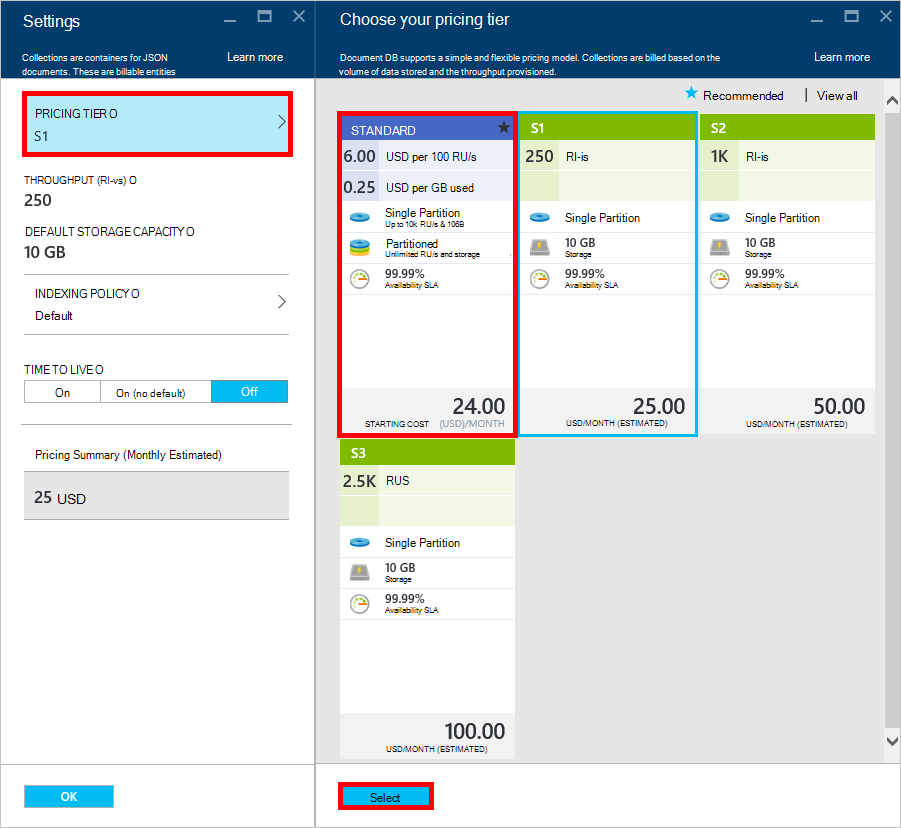
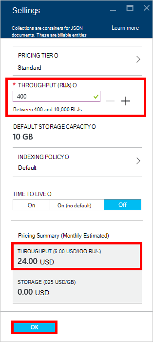

<properties 
    pageTitle="Supercharge your DocumentDB S1 account | Microsoft Azure" 
    description="Take advantage of increased throughput in your DocumentDB S1 account by making a few simple changes in the Azure portal." 
    services="documentdb" 
    authors="mimig1" 
    manager="jhubbard" 
    editor="monicar" 
    documentationCenter=""/>

<tags 
    ms.service="documentdb" 
    ms.workload="data-services" 
    ms.tgt_pltfrm="na" 
    ms.devlang="na" 
    ms.topic="article" 
    ms.date="08/25/2016" 
    ms.author="mimig"/>

# Supercharge your DocumentDB account

Follow these steps to take advantage of increased throughput for your Azure DocumentDB S1 account. With little to no additional cost, you can increase the throughput of your existing S1 account from 250 [RU/s](documentdb-request-units.md) to 400 RU/s, or more!  

> [AZURE.VIDEO changedocumentdbcollectionperformance]

## Change to user-defined performance in the Azure portal

1. In your browser, navigate to the [**Azure portal**](https://portal.azure.com). 
2. Click **Browse** -> **DocumentDB (NoSQL)**, then select the DocumentDB account to modify.   
3. In the **Databases** lens, select the database to modify, and then in the **Database** blade, select the collection with the S1 pricing tier.

      

4. In the **Collection** blade, click **More**, and then click **Settings**.   
5. In the **Settings** blade, click **Pricing Tier** and notice that the monthly cost estimate for each plan is displayed. In the **Choose your pricing tier** blade, click **Standard**, and then click **Select** to save your change.

      

6. Back in the **Settings** blade, the **Pricing Tier** is changed to **Standard** and the **Throughput (RU/s)** box is displayed with a default value of 400. Click **OK** to save your changes. 

    > [AZURE.NOTE] You can set the throughput between 400 and 10,000 [Request units](../articles/documentdb/documentdb-request-units.md)/second (RU/s). The **Pricing Summary** at the bottom of the page updates automatically to provide an estimate of the monthly cost.
    
    

8. Back on the **Database** blade, you can verify the supercharged throughput of the collection. 

    

For more information about the changes related to user-defined and pre-defined throughput, see the blog post [DocumentDB: Everything you need to know about using the new pricing options](https://azure.microsoft.com/blog/documentdb-use-the-new-pricing-options-on-your-existing-collections/).

## Next steps

If you determine that you need more throughput (greater than 10,000 RU/s) or more storage (greater than 10GB) you can create a partitioned collection. To create a partitioned collection, see [Create a collection](documentdb-create-collection.md).