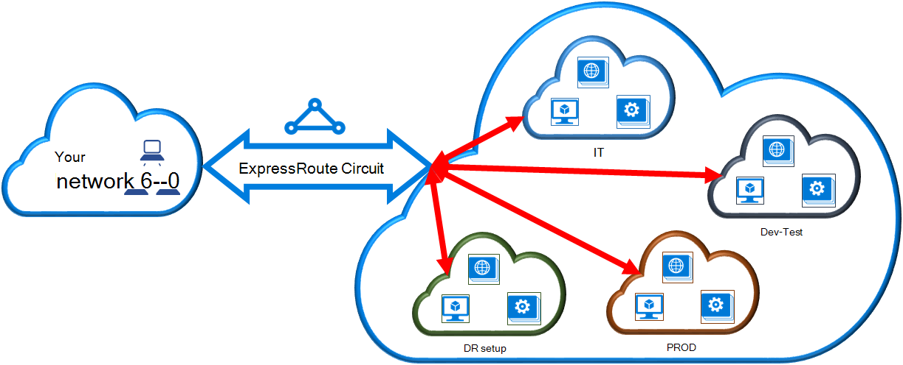

<properties
   pageTitle="Link a virtual network to an ExpressRoute circuit by using the classic deployment model and PowerShell | Microsoft Azure"
   description="This document provides an overview of how to link virtual networks (VNets) to ExpressRoute circuits by using the classic deployment model and PowerShell."
   services="expressroute"
   documentationCenter="na"
   authors="ganesr"
   manager="carmonm"
   editor=""
   tags="azure-service-management"/>
<tags
   ms.service="expressroute"
   ms.devlang="na"
   ms.topic="article"
   ms.tgt_pltfrm="na"
   ms.workload="infrastructure-services"
   ms.date="10/10/2016"
   ms.author="ganesr" />

# Link a virtual network to an ExpressRoute circuit

> [AZURE.SELECTOR]
- [Azure Portal - Resource Manager](expressroute-howto-linkvnet-portal-resource-manager.md)
- [PowerShell - Resource Manager](expressroute-howto-linkvnet-arm.md)
- [PowerShell - Classic](expressroute-howto-linkvnet-classic.md)

This article will help you link virtual networks (VNets) to Azure ExpressRoute circuits by using the classic deployment model and PowerShell. Virtual networks can either be in the same subscription or can be part of another subscription.

**About Azure deployment models**

[AZURE.INCLUDE [vpn-gateway-clasic-rm](../../includes/vpn-gateway-classic-rm-include.md)]

## Configuration prerequisites

1. You need the latest version of the Azure PowerShell modules. You can download the latest PowerShell modules from the PowerShell section of the [Azure Downloads page](https://azure.microsoft.com/downloads/). Follow the instructions in [How to install and configure Azure PowerShell](../powershell-install-configure.md) for step-by-step guidance on how to configure your computer to use the Azure PowerShell modules.
2. You need to review the [prerequisites](expressroute-prerequisites.md), [routing requirements](expressroute-routing.md), and [workflows](expressroute-workflows.md) before you begin configuration.
3. You must have an active ExpressRoute circuit.
    - Follow the instructions to [create an ExpressRoute circuit](expressroute-howto-circuit-classic.md) and have your connectivity provider enable the circuit.
    - Ensure that you have Azure private peering configured for your circuit. See the [Configure routing](expressroute-howto-routing-classic.md) article for routing instructions.
    - Ensure that Azure private peering is configured and the BGP peering between your network and Microsoft is up so that you can enable end-to-end connectivity.
    - You must have a virtual network and a virtual network gateway created and fully provisioned. Follow the instructions to [configure a virtual network for ExpressRoute](expressroute-howto-vnet-portal-classic.md).

You can link up to 10 virtual networks to an ExpressRoute circuit. All virtual networks must be in the same geopolitical region. You can link a larger number of virtual networks to your ExpressRoute circuit, or link virtual networks that are in other geopolitical regions if you enabled the ExpressRoute premium add-on. Check the [FAQ](expressroute-faqs.md) for more details on the premium add-on.

## Connect a virtual network in the same subscription to a circuit

You can link a virtual network to an ExpressRoute circuit by using the following cmdlet. Make sure that the virtual network gateway is created and is ready for linking before you run the cmdlet.

    New-AzureDedicatedCircuitLink -ServiceKey "*****************************" -VNetName "MyVNet"
    Provisioned

## Connect a virtual network in a different subscription to a circuit

You can share an ExpressRoute circuit across multiple subscriptions. The following figure shows a simple schematic of how sharing works for ExpressRoute circuits across multiple subscriptions.

Each of the smaller clouds within the large cloud is used to represent subscriptions that belong to different departments within an organization. Each of the departments within the organization can use their own subscription for deploying their services--but the departments can share a single ExpressRoute circuit to connect back to your on-premises network. A single department (in this example: IT) can own the ExpressRoute circuit. Other subscriptions within the organization can use the ExpressRoute circuit.

>[AZURE.NOTE] Connectivity and bandwidth charges for the dedicated circuit will be applied to the ExpressRoute circuit owner. All virtual networks share the same bandwidth.

### Administration

The *circuit owner* is the administrator/coadministrator of the subscription in which the ExpressRoute circuit is created. The circuit owner can authorize administrators/coadministrators of other subscriptions, referred to as *circuit users*, to use the dedicated circuit that they own. Circuit users who are authorized to use the organization's ExpressRoute circuit can link the virtual network in their subscription to the ExpressRoute circuit after they are authorized.

The circuit owner has the power to modify and revoke authorizations at any time. Revoking an authorization will result in all links being deleted from the subscription whose access was revoked.

### Circuit owner operations

#### Creating an authorization

The circuit owner authorizes the administrators of other subscriptions to use the specified circuit. In the following example, the administrator of the circuit (Contoso IT) enables the administrator of another subscription (Dev-Test) to link up to two virtual networks to the circuit. The Contoso IT administrator enables this by specifying the Dev-Test Microsoft ID. The cmdlet doesn't send email to the specified Microsoft ID. The circuit owner needs to explicitly notify the other subscription owner that the authorization is complete.

    New-AzureDedicatedCircuitLinkAuthorization -ServiceKey "**************************" -Description "Dev-Test Links" -Limit 2 -MicrosoftIds 'devtest@contoso.com'

    Description         : Dev-Test Links
    Limit               : 2
    LinkAuthorizationId : **********************************
    MicrosoftIds        : devtest@contoso.com
    Used                : 0

#### Reviewing authorizations

The circuit owner can review all authorizations that are issued on a particular circuit by running the following cmdlet:

    Get-AzureDedicatedCircuitLinkAuthorization -ServiceKey: "**************************"

    Description         : EngineeringTeam
    Limit               : 3
    LinkAuthorizationId : ####################################
    MicrosoftIds        : engadmin@contoso.com
    Used                : 1

    Description         : MarketingTeam
    Limit               : 1
    LinkAuthorizationId : @@@@@@@@@@@@@@@@@@@@@@@@@@@@@@@@@@@@
    MicrosoftIds        : marketingadmin@contoso.com
    Used                : 0

    Description         : Dev-Test Links
    Limit               : 2
    LinkAuthorizationId : &&&&&&&&&&&&&&&&&&&&&&&&&&&&&&&&&&&&
    MicrosoftIds        : salesadmin@contoso.com
    Used                : 2

#### Updating authorizations

The circuit owner can modify authorizations by using the following cmdlet:

    Set-AzureDedicatedCircuitLinkAuthorization -ServiceKey "**************************" -AuthorizationId "&&&&&&&&&&&&&&&&&&&&&&&&&&&&"-Limit 5

    Description         : Dev-Test Links
    Limit               : 5
    LinkAuthorizationId : &&&&&&&&&&&&&&&&&&&&&&&&&&&&&&&&&&&&&&
    MicrosoftIds        : devtest@contoso.com
    Used                : 0

#### Deleting authorizations

The circuit owner can revoke/delete authorizations to the user by running the following cmdlet:

    Remove-AzureDedicatedCircuitLinkAuthorization -ServiceKey "*****************************" -AuthorizationId "###############################"

### Circuit user operations

#### Reviewing authorizations

The circuit user can review authorizations by using the following cmdlet:

    Get-AzureAuthorizedDedicatedCircuit

    Bandwidth                        : 200
    CircuitName                      : ContosoIT
    Location                         : Washington DC
    MaximumAllowedLinks              : 2
    ServiceKey                       : &&&&&&&&&&&&&&&&&&&&&&&&&&&&&&&&&&&&
    ServiceProviderName              : equinix
    ServiceProviderProvisioningState : Provisioned
    Status                           : Enabled
    UsedLinks                        : 0

#### Redeeming link authorizations

The circuit user can run the following cmdlet to redeem a link authorization:

    New-AzureDedicatedCircuitLink –servicekey "&&&&&&&&&&&&&&&&&&&&&&&&&&" –VnetName 'SalesVNET1'

    State VnetName
    ----- --------
    Provisioned SalesVNET1

## Next steps

For more information about ExpressRoute, see the [ExpressRoute FAQ](expressroute-faqs.md).
