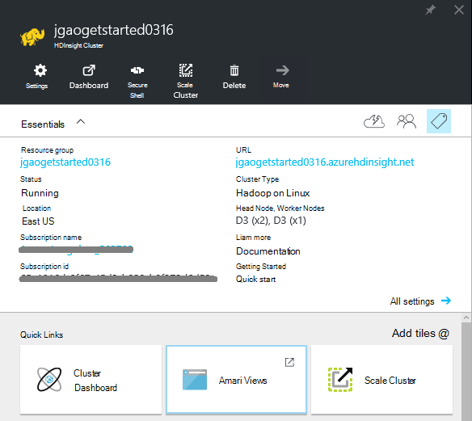
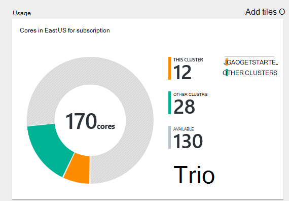
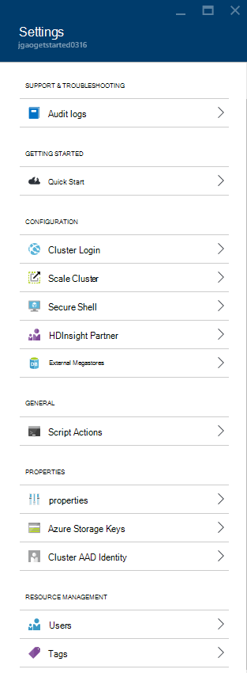
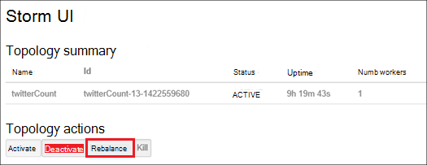
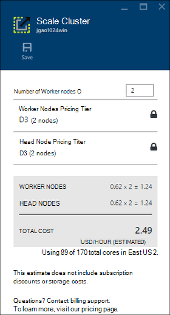

<properties
    pageTitle="Manage Linux-based Hadoop clusters in HDInsight using Azure portal | Microsoft Azure"
    description="Learn how to create and manage Linux-based HDInsight clusters using the Azure portal."
    services="hdinsight"
    documentationCenter=""
    authors="mumian"
    manager="jhubbard"
    editor="cgronlun"
    tags="azure-portal"/>

<tags
    ms.service="hdinsight"
    ms.workload="big-data"
    ms.tgt_pltfrm="na"
    ms.devlang="na"
    ms.topic="article"
    ms.date="08/10/2016"
    ms.author="jgao"/>

#Manage Hadoop clusters in HDInsight by using the Azure portal

[AZURE.INCLUDE [selector](../../includes/hdinsight-portal-management-selector.md)]

Using the [Azure portal][azure-portal], you can manage Linux-based clusters in Azure HDInsight. Use the tab selector for information on creating Hadoop clusters in HDInsight using other tools. 

**Prerequisites**

Before you begin this article, you must have the following:

- **An Azure subscription**. See [Get Azure free trial](https://azure.microsoft.com/documentation/videos/get-azure-free-trial-for-testing-hadoop-in-hdinsight/).

##Open the Portal

1. Sign in to [https://portal.azure.com](https://portal.azure.com).
2. After you open the portal, you can:

    - Click **New** from the left menu to create a new cluster:
    
        
    - Click **HDInsight Clusters** from the left menu to list the existing clusters
    
        

        If **HDInsight** doesn't appear in the left menu, click **Browse**, and then click **HDInsight Clusters**.

        

##Create clusters

[AZURE.INCLUDE [delete-cluster-warning](../../includes/hdinsight-delete-cluster-warning.md)]

HDInsight works with a wide range of Hadoop components. For the list of the components that have been verified and supported, see [What version of Hadoop is in Azure HDInsight](hdinsight-component-versioning.md). For the general cluster creation information, see [Create Hadoop clusters in HDInsight](hdinsight-hadoop-provision-linux-clusters.md). 

##List and show clusters

1. Sign in to [https://portal.azure.com](https://portal.azure.com).
2. Click **HDInsight Clusters** from the left menu to list the existing clusters.
3. Click the cluster name. If the cluster list is long, you can use filter on the top of the page.
4. Double-click a cluster from the list to show the details.

    **Menu and essentials**:

    
    
    - **Settings** and **All Settings**: Displays the **Settings** blade for the cluster, which allows you to access detailed configuration information for the cluster.
    - **Dashboard**, **Cluster Dashboard** and **URL: These are all ways to access the cluster dashboard, which is Ambari Web for Linux-based clusters.
    - **Secure Shell**: Shows the instructions to connect to the cluster using Secure Shell (SSH) connection.
    - **Scale Cluster**: Allows you to change the number of worker nodes for this cluster.
    - **Delete**: Deletes the cluster.
    - **Quickstart ()**: Displays information that will help you get started using HDInsight.
    - **Users ()**: Allows you to set permissions for _portal management_ of this cluster for other users on your Azure subscription.
    
        > [AZURE.IMPORTANT] This _only_ affects access and permissions to this cluster in the Azure portal, and has no effect on who can connect to or submit jobs to the HDInsight cluster.
    - **Tags ()**: Tags allows you to set key/value pairs to define a custom taxonomy of your cloud services. For example, you may create a key named __project__, and then use a common value for all services associated with a specific project.
    - **Ambari Views**: Links to Ambari Web.
    
    > [AZURE.IMPORTANT] To manage the services provided by the HDInsight cluster, you must use Ambari Web or the Ambari REST API. For more information on using Ambari, see [Manage HDInsight clusters using Ambari](hdinsight-hadoop-manage-ambari.md).

    **Usage**:
    
    
    
5. Click **Settings**.

    

    - **Audit logs**:
    - **Quick Start**:  Displays information that will help you get started using HDInsight.
    - **Scale Cluster**: Increase and decrease the number of cluster worker nodes.
    - **Secure Shell**: Shows the instructions to connect to the cluster using Secure Shell (SSH) connection.
    - **HDInsight Partner**: Add/remove the current HDInsight Partner.
    - **External Metastores**: View the Hive and Oozie metastores. The metastores can only be configured during the cluster creation process.
    - **Script Actions**: Run Bash scripts on the cluster.
    - **Properties**: View the cluster properties.
    - **Azure Storage Keys**: View the default storage account and its key. The storage account is configuration during the cluster creation process.
    - **Cluster AAD Identity**: 
    - **Users**: Allows you to set permissions for _portal management_ of this cluster for other users on your Azure subscription.
    - **Tags**: Tags allows you to set key/value pairs to define a custom taxonomy of your cloud services. For example, you may create a key named __project__, and then use a common value for all services associated with a specific project.
    
    > [AZURE.NOTE] This is a generic list of available settings; not all of them will be present for all cluster types.

6. Click **Properties**:

    The properties are:
    
    - **Hostname**: Cluster name.
    - **Cluster URL**.
    - **Status**: Include Aborted, Accepted, ClusterStorageProvisioned, AzureVMConfiguration, HDInsightConfiguration, Operational, Running, Error, Deleting, Deleted, Timedout, DeleteQueued, DeleteTimedout, DeleteError, PatchQueued, CertRolloverQueued, ResizeQueued, ClusterCustomization
    - **Region**: Azure location. For a list of supported Azure locations, see the **Region** dropdown list box on [HDInsight pricing](https://azure.microsoft.com/pricing/details/hdinsight/).
    - **Data created**.
    - **Operating system**: Either **Windows** or **Linux**.
    - **Type**: Hadoop, HBase, Storm, Spark. 
    - **Version**. See [HDInsight versions](hdinsight-component-versioning.md)
    - **Subscription**: Subscription name.
    - **Subscription ID**.
    - **Default data source**: The default cluster file system.
    - **Worker nodes pricing tier**.
    - **Head node pricing tier**.

##Delete clusters

Delete a cluster will not delete the default storage account or any linked storage accounts. You can re-create the cluster by using the same storage accounts and the same metastores. It is recommended to use a new default Blob container when you re-create the cluster.

1. Sign in to the [Portal][azure-portal].
2. Click **Browse All** from the left menu, click **HDInsight Clusters**, click your cluster name.
3. Click **Delete** from the top menu, and then follow the instructions.

See also [Pause/shut down clusters](#pauseshut-down-clusters).

##Scale clusters
The cluster scaling feature allows you to change the number of worker nodes used by a cluster that is running in Azure HDInsight without having to re-create the cluster.

>[AZURE.NOTE] Only clusters with HDInsight version 3.1.3 or higher are supported. If you are unsure of the version of your cluster, you can check the Properties page.  See [List and show clusters](#list-and-show-clusters).

The impact of changing the number of data nodes for each type of cluster supported by HDInsight:

- Hadoop

    You can seamlessly increase the number of worker nodes in a Hadoop cluster that is running without impacting any pending or running jobs. New jobs can also be submitted while the operation is in progress. Failures in a scaling operation are gracefully handled so that the cluster is always left in a functional state.

    When a Hadoop cluster is scaled down by reducing the number of data nodes, some of the services in the cluster are restarted. This causes all running and pending jobs to fail at the completion of the scaling operation. You can, however, resubmit the jobs once the operation is complete.

- HBase

    You can seamlessly add or remove nodes to your HBase cluster while it is running. Regional Servers are automatically balanced within a few minutes of completing the scaling operation. However, you can also manually balance the regional servers by logging into the headnode of cluster and running the following commands from a command prompt window:

        >pushd %HBASE_HOME%\bin
        >hbase shell
        >balancer

    For more information on using the HBase shell, see []
- Storm

    You can seamlessly add or remove data nodes to your Storm cluster while it is running. But after a successful completion of the scaling operation, you will need to rebalance the topology.

    Rebalancing can be accomplished in two ways:

    * Storm web UI
    * Command-line interface (CLI) tool

    Please refer to the [Apache Storm documentation](http://storm.apache.org/documentation/Understanding-the-parallelism-of-a-Storm-topology.html) for more details.

    The Storm web UI is available on the HDInsight cluster:

    

    Here is an example how to use the CLI command to rebalance the Storm topology:

        ## Reconfigure the topology "mytopology" to use 5 worker processes,
        ## the spout "blue-spout" to use 3 executors, and
        ## the bolt "yellow-bolt" to use 10 executors

        $ storm rebalance mytopology -n 5 -e blue-spout=3 -e yellow-bolt=10

**To scale clusters**

1. Sign in to the [Portal][azure-portal].
2. Click **Browse All** from the left menu, click **HDInsight Clusters**, click your cluster name.
3. Click **Settings** from the top menu, and then click **Scale Cluster**.
4. Enter **Number of Worker nodes**. The limit on the number of cluster node varies among Azure subscriptions. You can contact billing support to increase the limit.  The cost information will reflect the changes you have made to the number of nodes.

    

##Pause/shut down clusters

Most of Hadoop jobs are batch jobs that are only ran occasionally. For most Hadoop clusters, there are large periods of time that the cluster is not being used for processing. With HDInsight, your data is stored in Azure Storage, so you can safely delete a cluster when it is not in use.
You are also charged for an HDInsight cluster, even when it is not in use. Since the charges for the cluster are many times more than the charges for storage, it makes economic sense to delete clusters when they are not in use.

There are many ways you can program the process:

- User Azure Data Factory. See [Create on-demand Linux-based Hadoop clusters in HDInsight using Azure Data Factory](hdinsight-hadoop-create-linux-clusters-adf.md) for creating on-demand HDInsight linked services.
- Use Azure PowerShell.  See [Analyze flight delay data](hdinsight-analyze-flight-delay-data.md).
- Use Azure CLI. See [Manage HDInsight clusters using Azure CLI](hdinsight-administer-use-command-line.md).
- Use HDInsight .NET SDK. See [Submit Hadoop jobs](hdinsight-submit-hadoop-jobs-programmatically.md).

For the pricing information, see [HDInsight pricing](https://azure.microsoft.com/pricing/details/hdinsight/). To delete a cluster from the Portal, see [Delete clusters](#delete-clusters)

##Change passwords

An HDInsight cluster can have two user accounts. The HDInsight cluster user account (A.K.A. HTTP user account) and the SSH user account are created during the creation process. You can the Ambari web UI to change the cluster user account username and password, and script actions to change the SSH user account

###Change the cluster user password

You can use the Ambari Web UI to change the Cluster user password. To log into Ambari, you must use the existing cluster username and password.

> [AZURE.NOTE] If you change the cluster user (admin) password, this may cause script actions ran against this cluster to fail. If you have any persisted script actions that target worker nodes, these may fail when you add nodes to the cluster through resize operations. For more information on script actions, see [Customize HDInsight clusters using script actions](hdinsight-hadoop-customize-cluster-linux.md).

1. Sign in to the Ambari Web UI using the HDInsight cluster user credentials. The default username is **admin**. The URL is **https://&lt;HDInsight Cluster Name>azurehdinsight.net**.
2. Click **Admin** from the top menu, and then click "Manage Ambari". 
3. From the left menu, click **Users**.
4. Click **Admin**.
5. Click **Change Password**.

Ambari then changes the password on all nodes in the cluster.

###Change the SSH user password

1. Using a text editor, save the following as a file named __changepassword.sh__.

    > [AZURE.IMPORTANT] You must use an editor that uses LF as the line ending. If the editor uses CRLF, then the script will not work.
    
        #! /bin/bash
        USER=$1
        PASS=$2

        usermod --password $(echo $PASS | openssl passwd -1 -stdin) $USER

2. Upload the file to a storage location that can be accessed from HDInsight using an HTTP or HTTPS address. For example, a public file store such as OneDrive or Azure Blob storage. Save the URI (HTTP or HTTPS address,) to the file, as this is needed in the next step.

3. From the Azure portal, select your HDInsight cluster and then select __All settings__. From the __Settings__ blade, select __Script Actions__.

4. From the __Script Actions__ blade, select __Submit New__. When the __Submit script action__ blade appears, enter the following information.

  	| Field | Value |
  	| ----- | ----- |
  	| Name | Change ssh password |
  	| Bash script URI | The URI to the changepassword.sh file |
  	| Nodes (Head, Worker, Nimbus, Supervisor, Zookeeper, etc.) | ✓ for all node types listed |
  	| Parameters | Enter the SSH user name and then the new password. There should be one space between the user name and the password.
  	| Persist this script action ... | Leave this field unchecked.

5. Select __Create__ to apply the script. Once the script finishes, you will be able to connect to the cluster using SSH with the new password.

##Grant/revoke access

HDInsight clusters have the following HTTP web services (all of these services have RESTful endpoints):

- ODBC
- JDBC
- Ambari
- Oozie
- Templeton

By default, these services are granted for access. You can revoke/grant the access using [Azure CLI](hdinsight-administer-use-command-line.md#enabledisable-http-access-for-a-cluster) and [Azure PowerShell](hdinsight-administer-use-powershell.md#grantrevoke-access).

##Find the subscription ID

**To find your Azure subscription IDs**

1. Sign in to the [Portal][azure-portal].
2. Click **Browse All** from the left menu, and then click **Subscriptions**. Each subscription has a name and a ID.

Each cluster is tied to an Azure subscription. The subscription ID is shown on the cluster **Essential** tile. See [List and show clusters](#list-and-show-clusters).

##Find the resource group 

In the ARM mode, each HDInsight cluster is created with an Azure resource group. The Azure resource group that a cluster belongs to appears in:

- The cluster list has a **Resource Group** column.
- Cluster **Essential** tile.  

See [List and show clusters](#list-and-show-clusters).

##Find the default storage account

Each HDInsight cluster has a default storage account. The default storage account and its keys for a cluster appears under **Settings**/**Properties**/**Azure Storage Keys**. See [List and show clusters](#list-and-show-clusters).

##Run Hive queries

You cannot run Hive job directly from the Azure portal, but you can use the Hive View on Ambari Web UI.

**To run Hive queries using Ambari Hive View**

1. Sign in to the Ambari Web UI using the HDInsight cluster user credentials. The defaut username is **admin**. The URL is **https://&lt;HDInsight Cluster Name>azurehdinsight.net**.
2. Open Hive View as shown in the following screenshot:  

    
3. Click **Query** from the top menu.
4. Enter a Hive query in **Query Editor**, and then click **Execute**.

##Monitor jobs

See [Manage HDInsight clusters by using the Ambari Web UI](hdinsight-hadoop-manage-ambari.md#monitoring).

##Browse files

Using the Azure portal, you can browse the content of the default container.

1. Sign in to [https://portal.azure.com](https://portal.azure.com).
2. Click **HDInsight Clusters** from the left menu to list the existing clusters.
3. Click the cluster name. If the cluster list is long, you can use filter on the top of the page.
4. Click **Settings**.
5. From **Settings** blade, click **Azure Storage Keys**.
6. Click the default storage account name.
7. Click the **Blobs** tile.
8. Click the default container name.

##Monitor cluster usage

The __Usage__ section of the HDInsight cluster blade displays information about the number of cores available to your subscription for use with HDInsight, as well as the number of cores allocated to this cluster and how they are allocated for the nodes within this cluster. See [List and show clusters](#list-and-show-clusters).

> [AZURE.IMPORTANT] To monitor the services provided by the HDInsight cluster, you must use Ambari Web or the Ambari REST API. For more information on using Ambari, see [Manage HDInsight clusters using Ambari](hdinsight-hadoop-manage-ambari.md)

##Connect to a cluster

See [Use Hive with Hadoop in HDInsight with SSH](hdinsight-hadoop-use-hive-ssh.md#ssh).
    
##Next steps
In this article, you have learned how to create an HDInsight cluster by using the Portal, and how to open the Hadoop command-line tool. To learn more, see the following articles:

* [Administer HDInsight Using Azure PowerShell](hdinsight-administer-use-powershell.md)
* [Administer HDInsight Using Azure CLI](hdinsight-administer-use-command-line.md)
* [Create HDInsight clusters](hdinsight-provision-clusters.md)
* [Use Hive in HDInsight](hdinsight-use-hive.md)
* [Use Pig in HDInsight](hdinsight-use-pig.md)
* [Use Sqoop in HDInsight](hdinsight-use-sqoop.md)
* [Get Started with Azure HDInsight](hdinsight-hadoop-linux-tutorial-get-started.md)
* [What version of Hadoop is in Azure HDInsight?](hdinsight-component-versioning.md)

[azure-portal]: https://portal.azure.com
[image-hadoopcommandline]: ./media/hdinsight-administer-use-portal-linux/hdinsight-hadoop-command-line.png "Hadoop command line"
